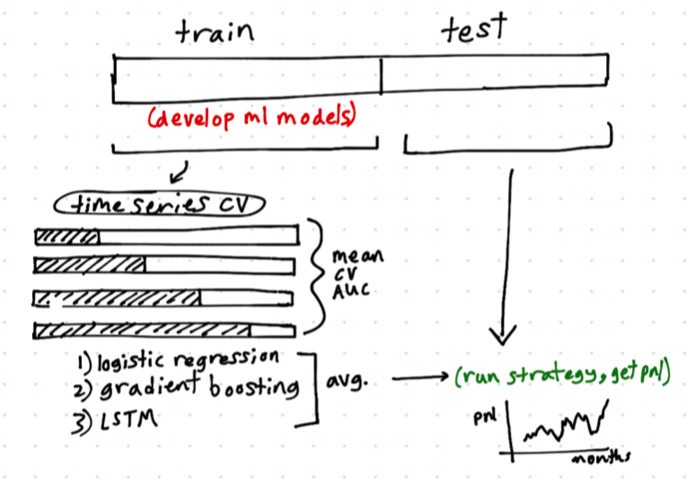
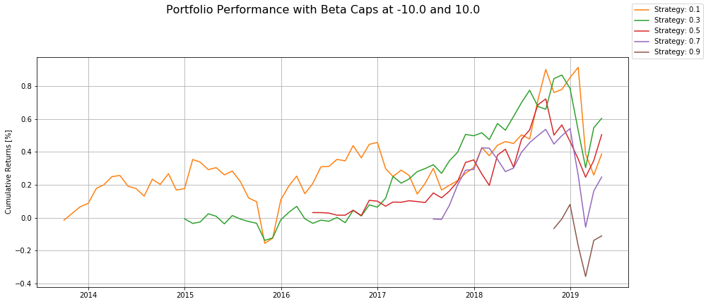
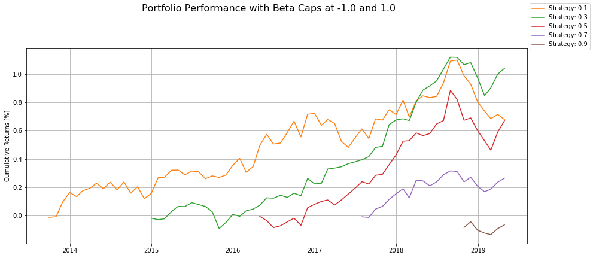
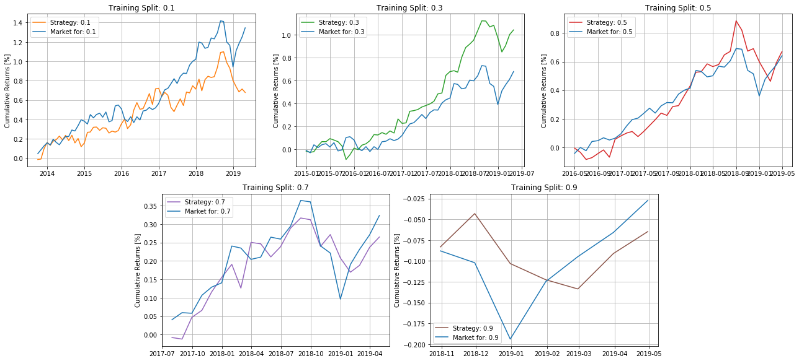
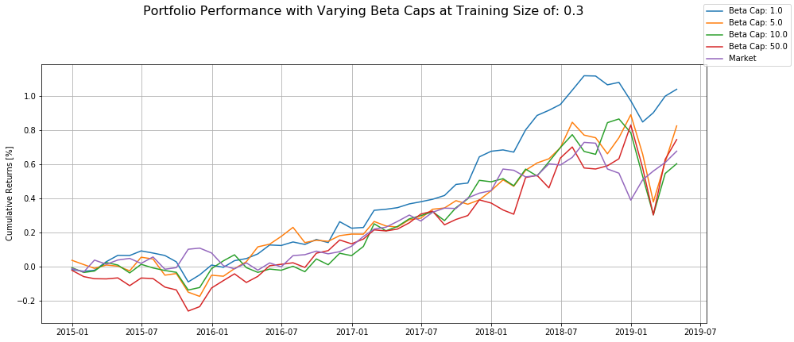
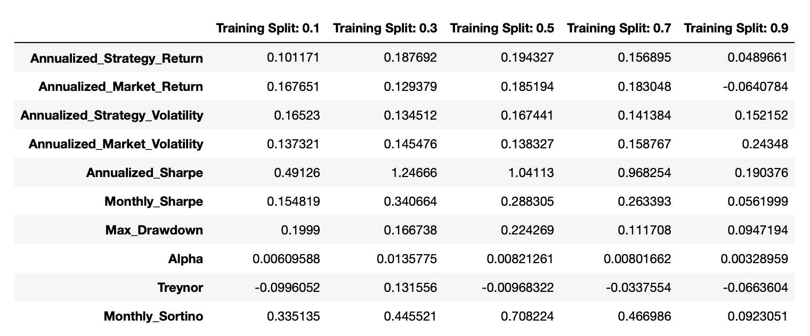
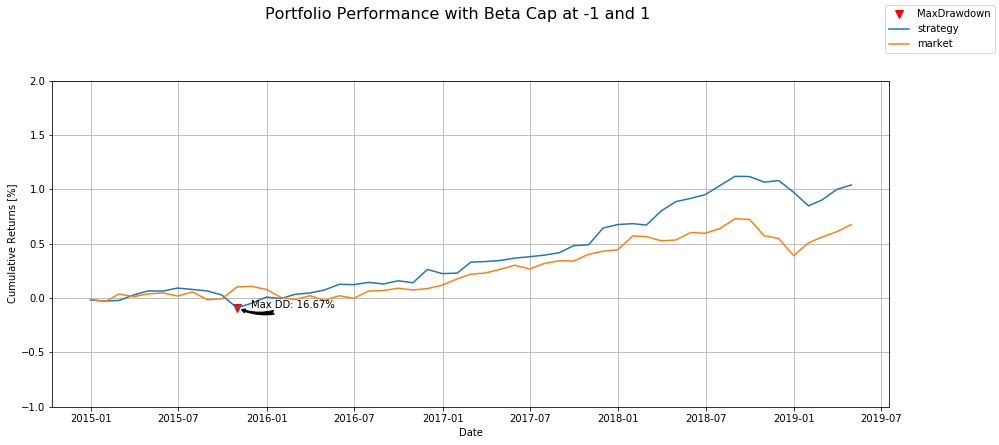
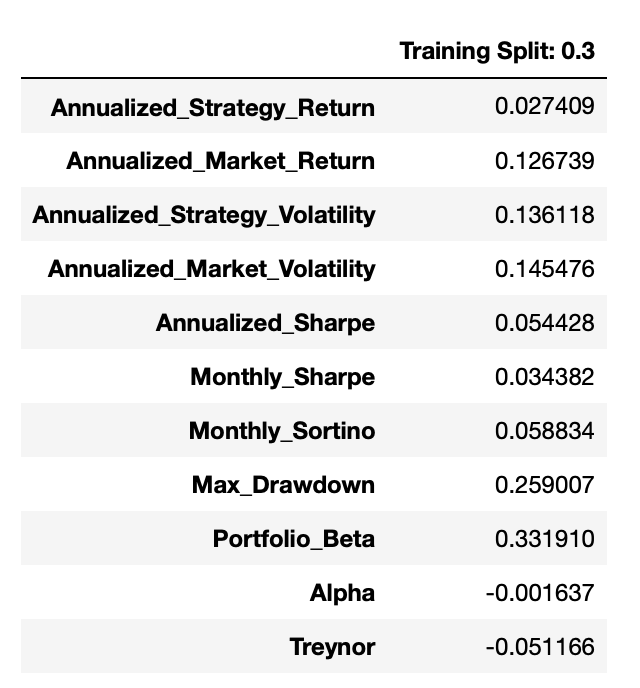
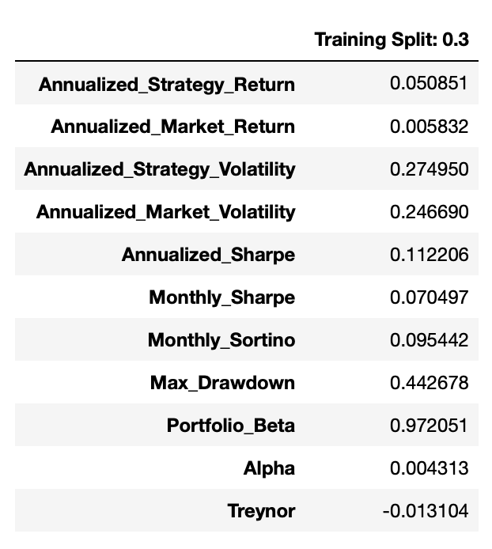

# Quantitative Investment Strategy
[Robert Hatem](https://www.linkedin.com/in/robert-e-hatem/ "LinkedIn Profile: Robert Hatem")  
[Benjamin Morgan](https://www.linkedin.com/in/benjaminmorgan0921/ "LinkedIn Profile: Benjamin Morgan")  
Spring 2019

Code can be found [`strategy.py`](strategy.py).

## Summary
Project combines logistic regression, gradient boosting, and LSTMs to predict next-month returns.






*Notice: this analysis is in-sample inference only.*


### Motivation Behind Exploring this Strategy:

The motivation behind exploring this strategy is to explore the investable opportunities in equities by analyzing their sentimental features. Quandl provided pre-computed sentiment features for equities that were easily accessible to analyze. Additionally, we wanted to explore basic machine learning algorithms for predicting next period returns and measure performance against the market as a benchmark.  

<!--To explore sentiment features, quandl provided pre-computed sentiment features that we could conveniently try out. Addeitionally, we wanted to try some basic machine learning algorithms for predicting next period returns. -->

Skiena et. al. (2010) uses sentiment data to build simple long-short strategies. Skiena’s dataset contains similar information to ours; it uses feature based on “polarity”, how positive or negative the mention is, and volume of news mentions. However, one difference is that Skiena separates information from blogs and news, while our dataset contains all sources together. They find that patterns from opinion in blogs persists longer than from news, which makes sense since opinions are less likely to contain “true” information that will change investors’ investment decisions. This paper provides evidence that sentiment-based investing, which we are analyzing in this write-up, is widespread. 

Fundamental analysis and investing is a widely-known investing technique that is used in different approaches but is ultimately based on how the company is perfoming as represented by their fundamental financial data. Charles Lee, the Henrietta J. Louis Professor at Cornell University, strives to connect fundamental value and investor sentiment with what is known as "fusion investing" in his Fusion Investing paper (2003). Lee states that while "researchers are finding that even though returns are difficult to predict, prediction is not an impossible task" and that there are observable systematic patterns in price return series (Lee 2003). While Lee takes the position of observing sentiment value from an investor, our strategy takes the available news sentiment data of the company, and not an individual investor, and attempts to predict performance within those believed systematic patterns.

### Creating a Universe of Equities to Use:
The idea of using sentiment as a basis for our strategy requires a few different components. First, we would need a universe of equities to use. We also need specific sentiment data for the strategy, end of day data to measure performance, and fundamental financial ratios as a complement to the sentiment data. The fundamental data consists of a set of Zack's files from the Quandl database and both the sentiment data and the end of day data were queried from Quandl using their Quandl API. 

Since the fundamental data is from fixed csv files, which can be found in [Quandl's Zacks Collection B database](https://www.quandl.com/databases/ZFB/data "Quandl Zacks"), that's where the universe of equities started. The fundamental dataset consists of **9107** unique tickers which established the foundation for our universe. The fundamental dataset contains the following columns as features: *Weighted Average Shares Outstanding, Current Ratio, Gross Margin, Operating Profit Margin, EBIT Margin, Pretax Profit Margin, Profit Margin, Free Cash Flow, Asset Turnover, Inventory Turover, Receivables Turnover, Days Sales in Receivables, Return on Equity, Return on Tangible Equity, Return on Assets, Return on Investments, Free Cash Flow Per Share, Book Value Per Share, and Operating Cash Flow Per Share.*

With the understanding that end of day data would be a bit easier to find than sentiment, we queried [quandl's sentiment database](https://www.quandl.com/data/NS1-FinSentS-Web-News-Sentiment "Quandl FinSent") with the **9107** tickers. The database consists of 5 different sentiment features: *Sentiment, Sentiment High, Sentiment Low, News Volume,* and *News Buzz*. 
   - The *Sentiment* feature is a numeric measure of the bullishness / bearishness of news coverage of the stock.
   - The *Sentiment High/Low* feature is the highest and lowest intraday sentiment scores.
   - The *News Volume* feature is the absolute number of news articles covering the stock.
   - The *News Buzz* feature is a numeric measure of the change in coverage volume for the stock.
   
We found that after filtering out the tickers that were not present in the database and handling any errors and data quality issues, such as missing data, the sentiment dataset held **4753** unique tickers with the 5 different feature sets. 

At that point, we took the smaller of the two ticker lists and scraped [Quandl's EOD database](https://www.quandl.com/data/EOD-End-of-Day-US-Stock-Prices "Quandl EOD"). After handling any present data quality issues, the EOD database contained **2490** unique tickers. 

After examining the three unique datasets, the selection of tickers to use for the merging of the three datasets came from the database with the smallest number of tickers: the end of day data. 

Running through the concatenating loop and adding a few more necessary filters to handle any remaining data quality issues during the concatenation, leaves a total of **1130** tickers in our universe with the necessary fundamental data, sentiment data, and end of day data. 

The output of the _ObtainDataFile.py_ script is a dictionary with two initial keys: *Raw_Data* and *Factors*. The *Factors* key contains a dictionary of [monthly](https://mba.tuck.dartmouth.edu/pages/faculty/ken.french/Data_Library/f-f_5_factors_2x3.html "Fama-French 5 Factor Monthly Data") and [daily](https://mba.tuck.dartmouth.edu/pages/faculty/ken.french/Data_Library/f-f_5_factors_2x3.html "Fama-French 5 Factor Daily Data") Five Factor datasets from [Fama and French](http://mba.tuck.dartmouth.edu/pages/faculty/ken.french/index.html "Kenneth French's Website"). The *Raw_Data* value contains **1130** dictionaries with the ticker as the key and a dataframe from the concatenation as the value.


<!--\*_The current script ObtainDataFile.py only reads data from csv files instead of querying Quandl. This is to save time because the queries can take a while. The code to query quandl is just commented out and instead, it just reads the necessary csv files that are in this project. The total time for this obtaining portion takes about 20 minutes to run on my specific computer._\*-->


```python
# from ObtainDataFile import *
#from PerformanceMetrics import *
# from strategy import *
```

By running the *start_running()* function, you will start the process of gathering and combining the data streams together to return a single dictionary data structure with the universe of tickers.


```python
# all_data = start_running()
# raw_data = pd.read_pickle('complete_dataset.pickle')
```

    Data compilation is complete. 
    1130 tickers in universe.
    File name is complete_dataset.pickle and is located in the local directory.


This *.read_pickle()* statement will read, instead of compile, the single dictionary data structure with the universe of tickers. 

## Strategy Description: 

This is a long-only equity strategy with monthly frequency. The equities for the given month are selected based on their predicted probability of having positive returns in the next month. The probability is predicted using three models averaged together:
1. logistic regression
2. gradient boosting, 
3. LSTM (long short-term memory) 

#### Target Variable
* 0: returns in following month are _negative_
* 1: returns in following month are _positive_

In other words, we predict the binary target variable of returns being positive or negative in the following month, using three sepearate models, then average their predictions (which are probabilities).

#### Equity selection
* average the three models' predictions
* select top 20%, go long a random half of them (10% total)
* go short the market by an amount $\beta$ times the amount you go long the equity. This is to be market neutral.

Beta is calculated as the correalation of the equity's daily returns with the market's returns (Nasdaq) over the previous month. We do _not_ go short any equities to avoid the complexities of shorting.

The models are selected using grid-search for logistic and gradient boosting, and using default values for the LSTM. The LSTM uses time windows of length (i.e. predicting next-month's return sign using the prior 3 months' values). The LSTM could be futher optimized to possibly get better performance.

#### Input features
* Features come as daily
* then aggregated to monthly using quantiles
* 50%, 75%, and 90% quantile of daily values over the previous month. 

For example, five daily features would turn in to 15 monthly features (5 features * 3 quantiles). This aggregation method allows us to use information about the _higher_ values from the previous month (90% quantile) as well as the _more typical_ values (50% quantile).

### Data
* 1130 tickers
* 76 months (January 2013 to April 2019)
* 69 features
  * 23 base features, each with 3 quantiles
    * 5 sentiment 
    * 17 fundamental


#### Generating Portfolios from our Randomly Selected Equity Positions in the top perfoming **20%** based on Performance Metrics

One idea was to take a random selection of positions that the strategy lists in the top **20%** -quantile. We observed 100 generated portfolios that all produced similar results, as you can see below. The figure of 100 histograms shows the distribution of their returns with a density line for each chart. 


<!-- Source Code is located in the RandomSelectionMetrics.ipynb file. -->

Each portfolio performed similarly across the months as well. Below, you can see a single histogram with a density line describing the mean returns across all portfolios for each month. 


<!-- Source Code is located in the RandomSelectionMetrics.ipynb file. -->

By taking the standard deviation of the monthly PnL across all the portfolios, we can observe the values increasing as time continues, as the figure below shows. 


<!-- Source Code is located in the RandomSelectionMetrics.ipynb file. -->

#### Analysis on Generating Portfolios from Random Equity Selections:
While the initial thought seemed like a good idea, in reality, the randomly selected equities to populate portfolios showed that there was no outstanding value in randomly selecting from our top performing equities in the top **20%**-quantile. This can easily be viewed in the **Distribution of Portfolio Returns...** figure showing that the portfolios more or less behaved the same over the given time period. 

### Running the Strategy:


```python
# i = 0.7 #fraction that is training data
# b_cap = 10 #beta cap
# s = True #includes sentiment features
# df_test, results = develop_all_three_models(frac_training=i, use_sentiment=s)    
# results_summary = run_strategy(df_test, ticker_dict=raw_data['Raw_Data'], sort_column='y_pred_avg', 
#                                seed=False, frac_long_tickers=0.01, mult_extra=2, beta_cap_floor=-b_cap, 
#                                beta_cap_ceil=b_cap, plot=False)
```

### Strategy Results and Performance Metrics:


```python
# take input of strategy. 
# total_dict = getStatsAll(results_summary) #using a beta cap of +/- 10. 
```


*Notice: this analysis is in-sample inference only.*

### The longer testing periods are more reliable
* The strategy is developed using progressivley larger training sets. The orange line was trained on only 10% of months (starting January 2013), and tested on the remaining 90% of months (up to April 2019).
* The strategy which was tested the shortest is the brown, and its returns are not good. In its five months, it swings widely and finishes barely positive.
* However, this strategy (three models estimated on training data, then averaged) is the least reliable because it was tested on the shortest period. It doesn't get much time to reveal its performance on test data, so we do not rely on these short test period. 
* However, using a shorter training set risks the model getting enough data to find the patterns in the data. With shorter training sets, the model could be less predictive, but we will more likely detect that it is unpredictive. With longer training sets, the model could be more predictive, but we are less likely to detect that it is unpredictive. 
* The brown line is the least reliable, due to its short testing period.

### The trend is up, but with a large drop at the end
* By contrast, the orange line was tested on 90% of the data, giving it a long testing period to reveal its performance out-of-sample. The orange line has an upward trend and a sharp dip at the end. This suggests some optimism, but so does the market returns. Also, there is concern from the large concern for the sudden drop.

### Large drop comes from large a net short position in the market moving against us
* The drop is due to large net short position in the market that happends to turn against us. This large short position comes from an unusually large individual beta. The large net short position (from one stock with unusually large beta) is not unique, but the adverse price change while holding the large position is unique. There are other periods where we hold large short market positions, but the price doesn't move so badly in those periods. In February and March, it does hurt us.

### Medium-range forecasts are similar, but with a slower start
* The remaining three strategies (greed, red, purple) show similar patterns; general upward trends with a large drop near the end (February and March). However, they are begin flat for the first few months before starting their rise.

### Let's address the large drop at the end
* Again, the large drop is due to large shorts market positions moving against us. It's difficult to predict when the market will move against us, so instead we will cap our short positions so that markets drops don't hurt as much (_favorable_ market moves will also help us less under capping. It limits both downside and upside).
* We now apply a hard cap to the short market positions that we are taking. The betas of any given stock in any prior month are generally less than 5, but sometimes larger 10 or even 30. The strategy runs above used a cap of 10, so now we tighten the cap to 5 (applied as absolute value of 5), and 1, to see if we can soften that large drop.

## Analysis


```python
# take input of strategy. 
# total_dict = getStatsAll(results_summary, beta_plot = True, training_split_value_to_plot=0.3) #using a beta cap of +/- 1. 
```







Regarding the Top Figure above:
* With the tight cap on beta (between -1 and 1), we again see a general upward trend. You can see that the strategy using the training size of 30% (green line) in the tightest beta constraint configuration of 1.0, outperforms the other training sizes in the same beta cap grouping. 

Regarding the Middle Figure of 5 plots above: 
* You can see that when the beta cap group of training sizes is separated into individual charts, the split size of 30% and 50% outperform the market but only the 30% split results significantly outperform the market. 

Regarding the Bottom Figure above:
* We choose training fraction of 0.3, then show the strategy using different caps for beta. There is mostly overlap, but the strictest beta cap (1.0) shows highest performance, especially by the end of the simulation.
* Also, the sharp drops around November 2016 and March 2019 seem to be softened, as was expected from the capping. However, the small caps (5 & 10) didn't seem to curtail the drops; only cap of 1 seems to work.
* For the first half of the strategy, capping seemed to have minimal effect. But by the end, the strict cap lead to the best performance.
* While capping could plausibly improve PnL here, keep in mind that it would also reduce the market-neutrality, which was the point of investing the index in the first place. We do not explore whether market-neutrality was affected here.
* The optimal stratey identified is when the training size is only 30% of the entire dataset with a beta cap of +/- 1.0. You can see that in the bottom figure below, the *Beta Cap: 1.0* line easily outperforms the others in the same training size group and outperforms the Market, the purple line. These results show that the strategy made smart decisions, did not take too many losses, and capitalized on an increasing Market.



The image above represents the dataframe of strategy results using a beta cap of 1.0. Our best performing strategy, using the training split of 30%, had an **Annualized Return of 18.77%, Annualized Volatility of 27.73%, an Annualized Sharpe of 0.605, a Max Drawdown of 0.167, and an Alpha of 0.014.** Below, you wcan see just how the strategy performs against the market since the start of 2015. The strategy looks promising but we need to stress test to be sure. 



### Stress Testing Against Simulated 2008 Performance Compared to Recent Performance Without Sentiment

Since the sentiment data does not go past 2013, we are opting to stress test the strategy by observing the strategy's performance without the sentiment features from 2015 to 2019 and observe the strategy's performance between 2005 and 2010. Then we will compare the differential performance of the annualized market returns and annualized strategy returns between the two time periods.




The strategy can be observed against the market from 2015 to 2019 in the time period above. Take note that the **Annualized Strategy Return is 2.74% against the Market's Annualized Return of 12.67%.** We will be comparing these along with the other listed metrics to the strategy's performance from 2015 to 2010.  




### Stress Testing Analysis
Now taking a look at the performance of the stressed strategy from 2007 through 2010. The strategy does produce a higher **Annualized Strategy Return of 5.09% against the Market's Annualized Return of 0.58%.** We do see a larger max drawdown and a larger portfolio beta on the stressed strategy and this can be expected. It is surprising to see that not only did the strategy perform positively during this period, it beat the market and beat the 2015-2019 period we were comparing it to. 

Some of the other metrics did perform better in the 2015-2019 dataset, such as a drawdown that is almost half at **0.259** and a much lower **portfolio beta at 0.332**. Volatility  was higher for both the strategy and the market during the stress period and this is expected since this was a purposeful stress run during a known financial crisis. 

### Concluding Thoughts:

We conclude that there is evidence of proof of concept utilizing a strategy that leverages sentiment data. While these initial results seem profitable and optimistic, it would be wise to continue with our testing by continuing to fine-tune the machine learning models, refine the universe filtering, and stress test against a different variety of scenarios and not just a single crisis. Sentiment data proves to be an unique feature set and as new natural language processing techniques continue to develop and employed, sentiment data will continue to grow and offer new ways of exploring different investment opportunities. 

<!-- ### Online Resources Include: 
- [Kenneth French's Website](http://mba.tuck.dartmouth.edu/pages/faculty/ken.french/index.html)
- [Quandl.com](https://www.quandl.com)
- [Quantopian.com](https://www.quantopian.com) 
- [Stackoverflow.com](https://stackoverflow.com)
-->

### Bibliography & Data Sources: 
1. **French, Kenneth R.** Kenneth R. French - Home Page. Accessed June 01, 2019.  
&nbsp;&nbsp;&nbsp;&nbsp;http://mba.tuck.dartmouth.edu/pages/faculty/ken.french/index.html.  
2. **Lee, Charles M.C.** 2003. Fusion Investing. Tech. Fusion Investing. AIMR.
3. **"Quandl."** Quandl.com. Accessed June 01, 2019.  
&nbsp;&nbsp;&nbsp;&nbsp;https://www.quandl.com/.  
4. **"The Place For Learning Quant Finance."** Quantopian. Accessed June 01, 2019.   
&nbsp;&nbsp;&nbsp;&nbsp;https://www.quantopian.com/.  
5. **"Where Developers Learn, Share, & Build Careers."** Stack Overflow. Accessed June 02, 2019.  
&nbsp;&nbsp;&nbsp;&nbsp;https://stackoverflow.com/.
6. **Zhang, Wenbin, and Steven Skiena.** 2010. Trading Strategies to Exploit Blog and News Sentiment. Tech.  
&nbsp;&nbsp;&nbsp;&nbsp;Trading Strategies to Exploit Blog and News Sentiment. Association for the Advancement of Artificial Intelligence.
